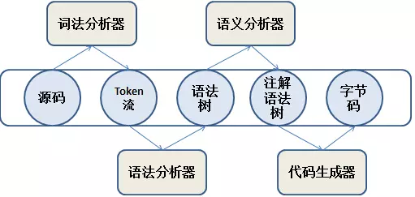

# 如何运行

- 执行`cd ./demo-ast-papa; mvn clean install`安装自定义注解处理器jar到本地库；
- 执行`cd ../demo-ast-test; mvn clean compile`编译测试代码（使用了自定义注解）；
  - 执行`javap target/classes/xj/love/hj/demo/ast/test/pojo/Sample.class`，查看对`@Getter`注解处理结果；
  - 执行`javap target/classes/xj/love/hj/demo/ast/test/pojo/SampleBuilder.class`，查看对`@Builder`注解处理结果；
- 运行`java -cp target/classes xj.love.hj.demo.ast.test.Application`查看结果。

## 禁用IDEA错误提示

打开`Sample.java`，选择`Analyze -> Configure Current File Anaylisis...`，将其设置为none即可。

# javac编译步骤

# 插件化注解处理API使用步骤

1. 自定义一个注解，注解的元注解需要指定`@Retention(RetentionPolicy.SOURCE)`。
2. 自定义一个注解处理器，需要继承[javax.annotation.processing.AbstractProcessor]
(https://docs.oracle.com/javase/8/docs/api/javax/annotation/processing/AbstractProcessor.html)，并重写process方法。
3. 需要在声明的自定义注解处理器中使用[javax.annotation.processing.SupportedAnnotationTypes]
(https://docs.oracle.com/javase/8/docs/api/javax/annotation/processing/SupportedAnnotationTypes.html)指定步骤1所创建的注解类型的名称
(注意需要全类名，"包名.注解类型名称"，否则会不生效)。
4. 需要在声明的自定义注解处理器中使用[javax.annotation.processing.SupportedSourceVersion]
(https://docs.oracle.com/javase/8/docs/api/javax/annotation/processing/SupportedSourceVersion.html)指定编译版本。
5. 可选操作，可以通在声明的自定义注解处理器中使用[javax.annotation.processing.SupportedOptions]
(https://docs.oracle.com/javase/8/docs/api/javax/annotation/processing/SupportedOptions.html)指定编译参数。

> [JSR 269: Pluggable Annotation Processing API](https://jcp.org/en/jsr/detail?id=269)
& [Lombok reduces your boilerplate code](https://blog.frankel.ch/lombok-reduces-your-boilerplate-code/)
